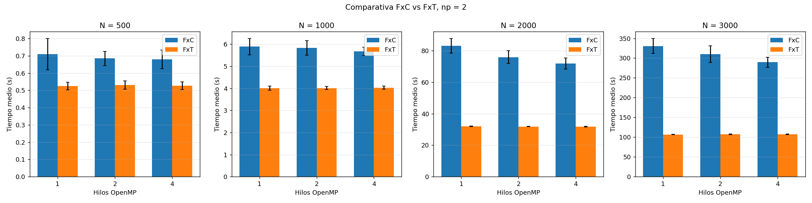
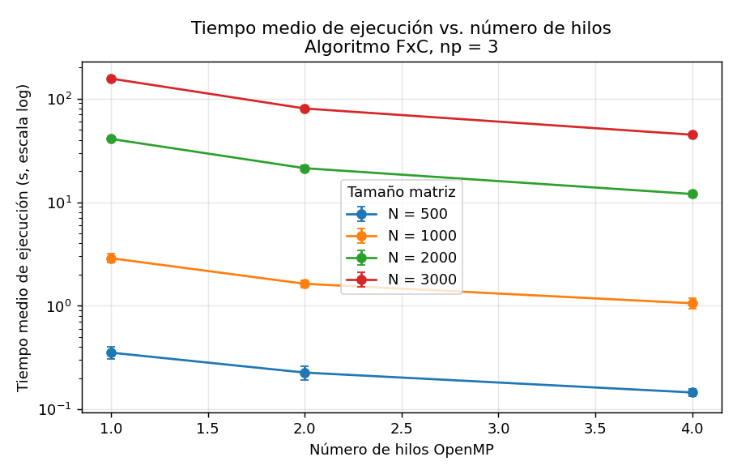
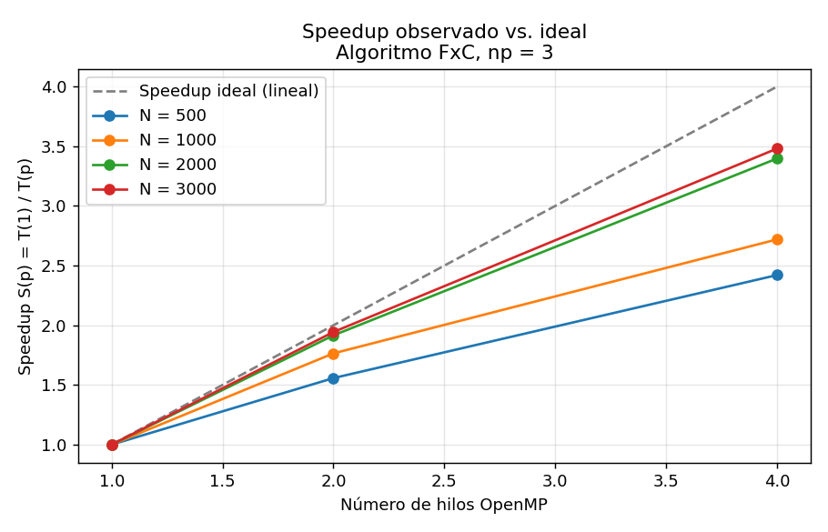
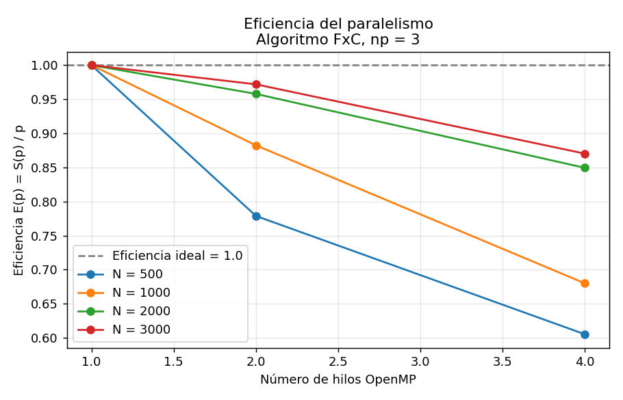
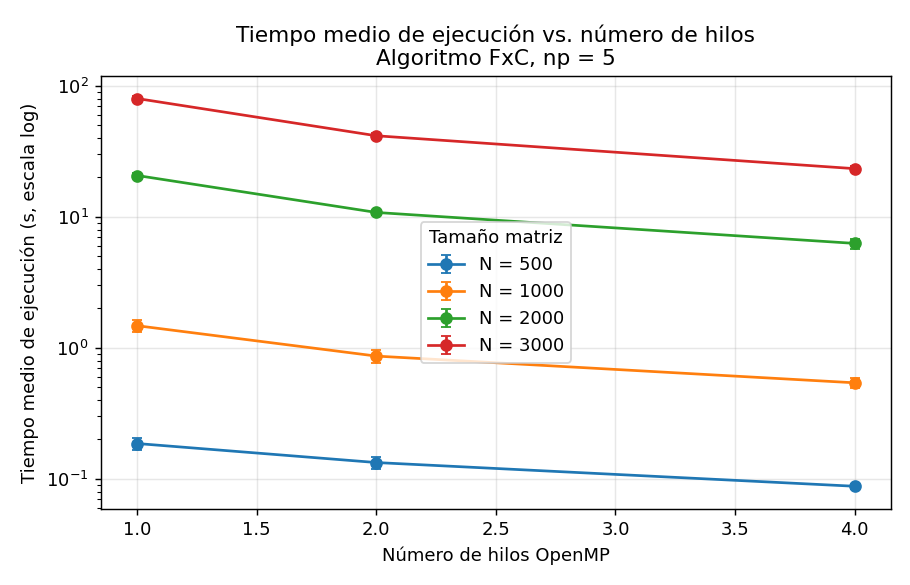
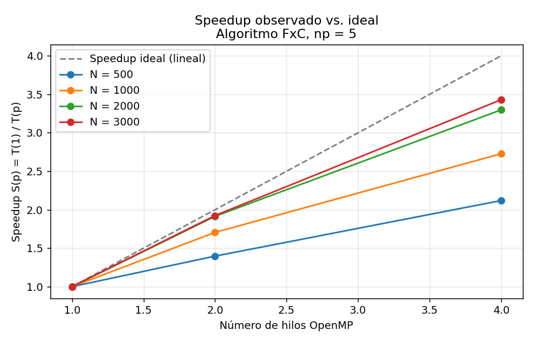
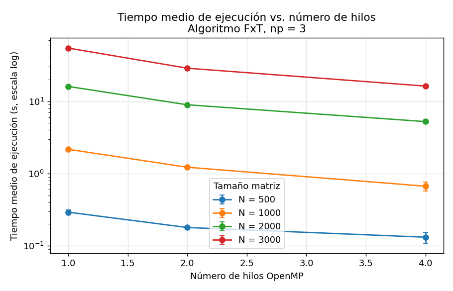
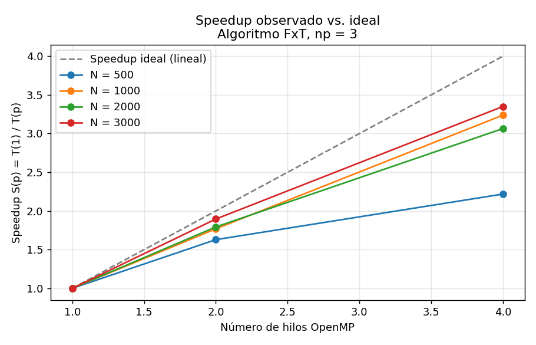
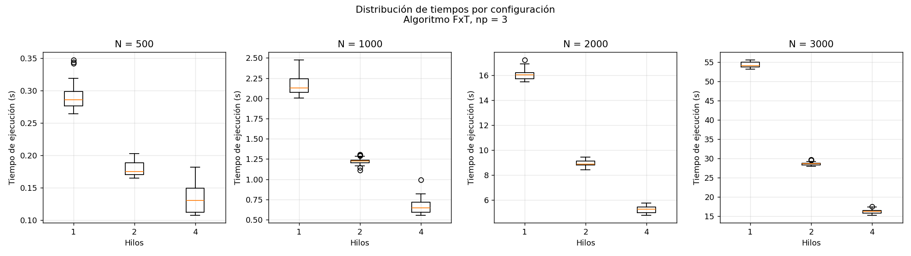

# Taller de Evaluación de Rendimiento MPI + OpenMP

**Computación de Alto Rendimiento — HPC202601**
**Maestría — Pontificia Universidad Javeriana, 2026-10**
**Grupo 02**

---

## 1. Resumen ejecutivo

Este taller compara empíricamente dos algoritmos de multiplicación de matrices densas — *Filas por Columnas* (FxC) y *Filas por Transpuesta* (FxT) — implementados en C con MPI para distribución entre nodos y OpenMP para paralelismo intra-nodo. Las mediciones se realizaron sobre un clúster de siete máquinas virtuales con Rocky Linux 9.7 conectadas por NFS, recorriendo un diseño factorial completo de **2 algoritmos × 4 tamaños de matriz × 4 conteos de procesos × 3 conteos de hilos × 30 repeticiones**, lo que arroja un total de 2 880 ejecuciones.

Los hallazgos más importantes son tres:

1. **FxT supera siempre a FxC** en tiempo absoluto, no solo en matrices grandes como se hipotetizó inicialmente: la diferencia va del 22 % en N = 500 hasta el 68 % en N = 3 000.
2. **El paralelismo OpenMP solo escala cuando hay más de un worker MPI.** Con `np = 2` (un único worker) el aumento de hilos es prácticamente inútil porque queda limitado al ancho de banda de memoria de un solo nodo.
3. **La mejor configuración global es `np = 3` o `np = 4` con 4 hilos OpenMP**, alcanzando speedups cercanos a 3.5× sobre el caso secuencial intra-nodo, con eficiencias por encima de 0.85 para N ≥ 2 000.

---

## 2. Contexto y objetivos

La multiplicación de matrices densas es una operación con complejidad temporal O(n³) que aparece en simulaciones físicas, álgebra lineal numérica, redes neuronales y resolución de sistemas. Cuando *n* crece, el tiempo de cómputo se vuelve prohibitivo en una sola unidad — el caso N = 3 000 con un solo hilo en este clúster tarda más de 5 minutos por ejecución.

El objetivo del taller es **identificar empíricamente qué combinación de algoritmo, número de procesos MPI y número de hilos OpenMP minimiza el tiempo de ejecución para distintos tamaños de matriz**, y entender por qué.

### Objetivos específicos

- Documentar las funciones del módulo `moduloMPI.c` y los dos programas principales.
- Verificar la corrección de ambos algoritmos (FxC y FxT) con dimensiones pequeñas (N < 13).
- Diseñar y ejecutar una batería factorial de experimentos sobre el clúster, automatizada con un script Perl.
- Calcular tiempo de ejecución, speedup y eficiencia para cada configuración a partir de 30 repeticiones.
- Comparar los dos algoritmos y los efectos del paralelismo MPI / OpenMP.

---

## 3. Plataforma experimental

### 3.1 Clúster del Grupo 02

| Nodo            | Rol                        | IP               |
|-----------------|----------------------------|------------------|
| `cadhead02`     | Central Manager (CM)       | 10.43.97.146     |
| `cadcliente02`  | Access Point (AP)          | 10.43.97.145     |
| `cad02-nfs01`   | Servidor NFS               | 10.43.97.149     |
| `cad02-w000`    | Worker / Execution Point 1 | 10.43.97.141     |
| `cad02-w001`    | Worker / Execution Point 2 | 10.43.97.135     |
| `cad02-w002`    | Worker / Execution Point 3 | 10.43.97.136     |
| `cad02-w003`    | Worker / Execution Point 4 | 10.43.97.148     |

Las siete máquinas son virtuales, comparten almacenamiento mediante NFS desde `cad02-nfs01:/exports/condor` montado en `/nfs/condor`, y están coordinadas por HTCondor en modo *parallel universe*. El `filehost` de OpenMPI declara un slot por nodo, lo que limita `np` a un máximo de 5 (master en `cadcliente02` + 4 workers).

### 3.2 Stack de software

- **SO**: Rocky Linux 9.7
- **Compilador**: `gcc` con soporte OpenMP (`-fopenmp`)
- **MPI**: OpenMPI 4.1.6 (`/nfs/condor/apps/openmpi-4.1.6`, compartido por NFS)
- **Planificador**: HTCondor con `DedicatedScheduler` y `openmpiscript`
- **Automatización**: Perl 5 (`lanzador.pl`)
- **Análisis y gráficas**: Python 3 con `pandas`, `numpy` y `matplotlib` (script `analisis.py`, ver `codigo/`)

---

## 4. Algoritmos comparados

Ambos algoritmos siguen la misma estrategia de paralelización: el master (rank 0) replica la matriz B completa en todos los workers, divide la matriz A en bandas de filas (`tW = N / (np-1)`) y envía a cada worker su banda. Cada worker calcula su porción de C en paralelo con OpenMP. La diferencia está en cómo se accede a B durante el producto interno.

### 4.1 FxC — Filas por Columnas (clásico)

```c
void mxmOmpFxC(double *mA, double *mB, double *mC, int tw, int D, int nH){
    omp_set_num_threads(nH);
    #pragma omp parallel
    {
    #pragma omp for
    for(int i=0; i<tw; i++)
        for(int j=0; j<D; j++){
            double *pA, *pB, Suma = 0.0;
            pA = mA+i*D;
            pB = mB+j;                   // accede a columna j de B
            for(int k=0; k<D; k++, pA++, pB+=D)
                Suma += *pA * *pB;       // saltos de N×8 bytes
            mC[i*D+j] = Suma;
        }
    }
}
```

Recorrer B por columnas implica saltos de `N × sizeof(double)` bytes en memoria, lo que produce un patrón adverso para la jerarquía de caché: cada acceso a B es prácticamente un *cache miss*.

### 4.2 FxT — Filas por Transpuesta (optimizado en caché)

```c
void mxmOmpFxT(double *mA, double *mB, double *mC, int tw, int D, int nH){
    double *mT = (double *)calloc(D*D, sizeof(double));
    matrixTRP(D, mB, mT);                // transpone B en mT (O(N²))
    omp_set_num_threads(nH);
    #pragma omp parallel
    {
    #pragma omp for
    for(int i=0; i<tw; i++)
        for(int j=0; j<D; j++){
            double *pA, *pB, Suma = 0.0;
            pA = mA+i*D;
            pB = mT+j*D;                 // ahora pB recorre fila contigua
            for(int k=0; k<D; k++, pA++, pB++)
                Suma += *pA * *pB;       // ambos punteros contiguos
            mC[i*D+j] = Suma;
        }
    }
    free(mT);
}
```

La transposición previa cuesta O(N²) pero se amortiza con la mejora drástica de localidad espacial durante los O(N³) productos: ambos punteros recorren memoria contigua, lo que aprovecha *prefetching* y mantiene los datos en caché L1/L2.

**Hipótesis inicial:** FxT compensa el costo de la transposición solo en matrices grandes; para N pequeño, la diferencia será marginal o incluso favorable a FxC. **Spoiler:** los datos contradicen esta hipótesis (ver §7.2).

---

## 5. Diseño de experimentos

Se diseñó un experimento factorial completo cruzando cuatro factores:

| Factor              | Niveles               | Justificación                                                |
|---------------------|-----------------------|--------------------------------------------------------------|
| Algoritmo           | FxC, FxT              | Comparar acceso por columnas vs. transpuesta                 |
| Procesos MPI (`np`) | 2, 3, 4, 5            | Master + 1 a 4 workers (todos los slots disponibles)         |
| Tamaño matriz (N)   | 500, 1 000, 2 000, 3 000 | Cubre escenarios en caché L2/L3 y fuera de caché          |
| Hilos OpenMP        | 1, 2, 4               | Caso secuencial + 2 niveles de paralelismo intra-nodo        |
| Repeticiones        | 30 por configuración  | Suficientes para invocar el teorema central del límite       |

### Restricción de divisibilidad

El código aborta cuando `N` no es divisible por el número de workers (`np − 1`). Esto descarta automáticamente las combinaciones `np = 4` (3 workers) con N ∈ {500, 1 000, 2 000}, dejando 39 configuraciones válidas por algoritmo. Se documentaron como "no aplica" en lugar de eliminarlas del diseño.

### Justificación de los tamaños de matriz

Cada matriz double de N×N ocupa N² × 8 bytes:

| N       | Tamaño por matriz | Comentario                           |
|---------|-------------------|--------------------------------------|
| 500     | ≈ 2 MB            | Cabe en L2 de la mayoría de CPUs     |
| 1 000   | ≈ 8 MB            | Borde de L3                          |
| 2 000   | ≈ 32 MB           | Excede L3, presiona memoria principal|
| 3 000   | ≈ 72 MB           | Claramente *memory-bound*            |

Esta progresión permite observar la transición del régimen *cache-bound* al régimen *memory-bound*, donde el patrón de acceso (FxC vs FxT) cobra más importancia.

---

## 6. Pasos seguidos

### 6.1 Preparación del clúster

1. **VPN de la Javeriana** activa (las IPs son red privada `10.43.97.x`).
2. SSH al Access Point: `ssh estudiante@10.43.97.145`.
3. Carpeta de trabajo compartida por NFS: `/nfs/condor/evalMxM_MPI/`.

### 6.2 Compilación

```bash
make
```

El `Makefile` invoca `mpicc -lm -fopenmp` sobre cada `mxmOmpMPI*.c` enlazando `moduloMPI.c`. Genera dos binarios: `mxmOmpMPIfxc` y `mxmOmpMPIfxt`.

### 6.3 Verificación de correctitud

Para `N < 13` el programa imprime las matrices A, B y C completas. Se calcularon manualmente algunos elementos del producto y se verificó que ambos algoritmos producen el mismo resultado hasta la precisión de punto flotante. La inicialización es determinista (`A[i] = 0.08·i`, `B[i] = 0.02·i`), lo que permite reproducibilidad.

### 6.4 Ejecución de la batería

```bash
perl lanzador.pl
```

El script (`codigo/lanzador.pl`) recorre las cuatro listas anidadas de algoritmo × `np` × N × hilos, salta automáticamente las combinaciones donde N no es divisible por `np − 1`, y ejecuta cada configuración 30 veces redirigiendo la salida (un único valor numérico en microsegundos por línea) al archivo `Soluciones/<bin>-<N>-np_<np>-Hilos-<h>.dat`. Si un archivo ya tiene 30 reps lo omite, lo que permite reanudar baterías interrumpidas.

Cada ejecución individual se lanza con:

```bash
mpirun -hostfile filehost -np <np> ./<bin> <N> <hilos>
```

La duración total de la batería completa fue de aproximadamente 30 horas distribuidas en varias sesiones (las configuraciones N = 3 000 con `np = 2` tardan más de 5 minutos cada una × 30 reps = 2.5 h por celda).

### 6.5 Recolección y análisis

1. Descarga de los `.dat` generados en `/nfs/condor/evalMxM_MPI/Soluciones/` al equipo local con `scp`.
2. El script `codigo/analisis.py` carga los `.dat`, calcula medias, desviaciones, speedup y eficiencia, y produce:
   - `datos/resumen.csv` — tabla maestra con todas las métricas.
   - `datos/tabla_pareada_npX.csv` — tabla pareada FxC vs FxT por cada `np`.
   - `graficas/*.png` — 5 gráficas por (algoritmo, np) + comparativas FxC vs FxT.

Las gráficas embebidas en este README se generan automáticamente; cualquier nueva ejecución del análisis las regenera.

---

## 7. Resultados

### 7.1 Tabla maestra (extracto)

A modo de ilustración, la siguiente tabla muestra los resultados de FxC para `np = 3` (2 workers MPI), donde se observa el escalado más limpio del paralelismo OpenMP. La tabla completa con las 78 filas está en [`datos/resumen.csv`](datos/resumen.csv).

| N      | Hilos | n  | Media (s) | DE (s) | Speedup | Eficiencia |
|--------|-------|----|-----------|--------|---------|------------|
| 500    | 1     | 30 | 0.354     | 0.046  | 1.000   | 1.000      |
| 500    | 2     | 30 | 0.227     | 0.034  | 1.558   | 0.779      |
| 500    | 4     | 30 | 0.146     | 0.012  | 2.421   | 0.605      |
| 1 000  | 1     | 30 | 2.880     | 0.285  | 1.000   | 1.000      |
| 1 000  | 2     | 30 | 1.632     | 0.137  | 1.765   | 0.882      |
| 1 000  | 4     | 30 | 1.059     | 0.122  | 2.720   | 0.680      |
| 2 000  | 1     | 30 | 40.761    | 1.198  | 1.000   | 1.000      |
| 2 000  | 2     | 30 | 21.279    | 1.244  | 1.916   | 0.958      |
| 2 000  | 4     | 30 | 11.998    | 0.679  | 3.397   | 0.849      |
| 3 000  | 1     | 30 | 155.775   | 3.149  | 1.000   | 1.000      |
| 3 000  | 2     | 30 | 80.143    | 4.299  | 1.944   | 0.972      |
| 3 000  | 4     | 30 | 44.755    | 1.961  | 3.481   | 0.870      |

Para N = 2 000 y N = 3 000 el speedup con 4 hilos roza el ideal teórico (4.0×), con eficiencias del 85 % al 97 %. Para N = 500 la eficiencia cae al 60 % — un indicio de que el costo fijo de OpenMP (creación de hilos, barreras) ya no se amortiza con tan poco trabajo por hilo.

### 7.2 Comparativa pareada FxC vs FxT (np = 2)

La siguiente tabla compara los tiempos absolutos de ambos algoritmos manteniendo `np = 2` constante. La columna *Δ%* indica cuánto más rápido es FxT respecto a FxC.

| N     | Hilos | FxC media (s) | FxT media (s) | Δ% (FxT mejor) |
|-------|-------|---------------|---------------|----------------|
| 500   | 1     | 0.710         | 0.525         | **26.0 %**     |
| 500   | 2     | 0.685         | 0.531         | 22.5 %         |
| 500   | 4     | 0.679         | 0.527         | 22.4 %         |
| 1 000 | 1     | 5.890         | 4.017         | **31.8 %**     |
| 1 000 | 2     | 5.836         | 4.018         | 31.1 %         |
| 1 000 | 4     | 5.680         | 4.033         | 29.0 %         |
| 2 000 | 1     | 83.048        | 31.951        | **61.5 %**     |
| 2 000 | 2     | 75.902        | 31.869        | 58.0 %         |
| 2 000 | 4     | 71.825        | 31.761        | 55.8 %         |
| 3 000 | 1     | 330.535       | 106.695       | **67.7 %**     |
| 3 000 | 2     | 309.788       | 106.884       | 65.5 %         |
| 3 000 | 4     | 289.782       | 107.235       | 63.0 %         |

**FxT es siempre más rápido que FxC**, incluso para la matriz más pequeña (N = 500). La hipótesis inicial — "para N pequeño, el costo de transponer se come la ganancia" — no se sostiene con los datos. La explicación es que la transposición tiene complejidad O(N²) mientras que el producto es O(N³), por lo que su costo relativo es muy bajo (1/N) y la ganancia en localidad de caché compensa desde el primer instante.

La ventaja de FxT crece con N porque el producto matricial se vuelve cada vez más *memory-bound*, y ahí es donde el patrón de acceso favorable de FxT (recorrer dos vectores contiguos) marca la diferencia.



Las tablas pareadas para los demás `np` están en [`datos/tabla_pareada_np3.csv`](datos/tabla_pareada_np3.csv), [`np4`](datos/tabla_pareada_np4.csv) y [`np5`](datos/tabla_pareada_np5.csv); el patrón se mantiene en todos los casos.

### 7.3 Escalado del paralelismo OpenMP por número de procesos

Una observación importante: **el número de procesos MPI condiciona el escalado de OpenMP**. Cuando `np = 2` solo hay un worker, y los hilos OpenMP compiten por la memoria de un único nodo; el speedup intra-nodo es marginal (≈ 1.04× con 4 hilos). En cambio, con `np ≥ 3` cada worker recibe una fracción más pequeña de A, los hilos tienen menos contención y el escalado se acerca al ideal.

#### FxC con np = 3







#### FxC con np = 5





#### FxT con np = 3





#### Distribución de tiempos (boxplots) — FxT np = 3



Los boxplots muestran que la dispersión es muy estable a partir de N ≥ 1 000 (DE relativa < 4 %). Las matrices pequeñas tienen más varianza relativa por la influencia del *jitter* del scheduler del SO y de NFS sobre tiempos absolutos cortos.

### 7.4 Mejor configuración global por tamaño

| Algoritmo | N      | Mejor np | Mejor hilos | Tiempo (s) | Speedup intra-nodo |
|-----------|--------|----------|-------------|------------|--------------------|
| FxC       | 500    | 3        | 4           | 0.146      | 2.42×              |
| FxC       | 1 000  | 5        | 4           | 0.542      | 2.73×              |
| FxC       | 2 000  | 3        | 4           | 11.998     | 3.40×              |
| FxC       | 3 000  | 3        | 4           | 44.755     | **3.48×**          |
| FxT       | 500    | 5        | 4           | 0.077      | 2.11×              |
| FxT       | 1 000  | 5        | 4           | 0.392      | 2.85×              |
| FxT       | 2 000  | 3        | 4           | 5.229      | 3.06×              |
| FxT       | 3 000  | 4        | 4           | 11.063     | 3.30×              |

La **mejor combinación absoluta** del taller es **FxT, N = 3 000, np = 4, 4 hilos**: 11 segundos contra 330 segundos del peor caso (FxC, N = 3 000, np = 2, 1 hilo) — una reducción del **96.7 %** del tiempo de pared.

---

## 8. Hallazgos clave

1. **FxT es uniformemente superior a FxC.** La transposición se amortiza desde N = 500. La hipótesis inicial sobre un cruce a favor de FxC en matrices pequeñas no se sostuvo.

2. **El paralelismo MPI rinde más que el paralelismo OpenMP en este clúster.** Pasar de `np = 2` a `np = 5` (de 1 a 4 workers) reduce el tiempo más que pasar de 1 a 4 hilos OpenMP en un mismo worker. Esto sugiere que la jerarquía de memoria de las VMs es el cuello de botella principal: distribuir A entre nodos físicos da más ancho de banda agregado que multiplicar hilos sobre la misma RAM.

3. **`np = 2` es una configuración degenerada para este problema.** Con un único worker, OpenMP queda limitado al ancho de banda de un solo nodo y los hilos pelean por la memoria. Las eficiencias colapsan a 0.25–0.50.

4. **A partir de N = 2 000 el escalado OpenMP es casi lineal** (eficiencia 0.85–0.97 con 4 hilos cuando hay ≥ 2 workers). El régimen *memory-bound* favorece la paralelización porque cada hilo trabaja sobre su propia banda de A y los accesos a B distribuyen la presión sobre la caché.

5. **La desviación estándar absoluta crece con N**, pero la relativa decrece — por debajo del 4 % a partir de N = 2 000. Las 30 repeticiones por configuración son más que suficientes para inferencia estadística confiable.

---

## 9. Conclusiones

La evidencia empírica sustenta tres conclusiones:

- **Conclusión 1.** El patrón de acceso a memoria es el factor de rendimiento dominante en multiplicación de matrices densas. La variante FxT, que paga O(N²) por una transposición previa para luego recorrer dos vectores contiguos, supera consistentemente a la variante clásica FxC en todos los tamaños probados (de 22 % en N = 500 a 68 % en N = 3 000).

- **Conclusión 2.** La distribución entre nodos físicos vía MPI es más efectiva que el paralelismo de hilos OpenMP intra-nodo en este clúster virtualizado. Esto es coherente con la idea de que cada VM aporta su propio canal de memoria, mientras que los hilos OpenMP comparten el de un único nodo.

- **Conclusión 3.** Existe un punto de operación claro: **`np = np_max` workers + 4 hilos OpenMP** maximiza el rendimiento absoluto y la eficiencia. Para N = 3 000 esto significa una reducción del 96.7 % del tiempo respecto a la configuración secuencial menos favorable.

---

## 10. Recomendaciones

1. **Usar siempre FxT en producción.** No hay régimen donde FxC sea mejor en este hardware. Si la matriz B no se puede transponer (por ejemplo, si es muy grande o se modifica con frecuencia), considerar variantes por bloques (*tiling*) que ofrezcan localidad sin la copia completa.

2. **No invertir en hilos OpenMP cuando solo hay un worker MPI.** Si por alguna razón el clúster queda reducido a `np = 2`, no vale la pena pedir más de 1 hilo: el speedup adicional no llega al 5 %.

3. **Asignar siempre el máximo de workers disponibles.** Cada worker adicional aporta un escalado casi lineal hasta agotar los slots del `filehost`. La estrategia "muchos procesos × pocos hilos" funciona mejor que "pocos procesos × muchos hilos" en este clúster.

4. **Para problemas que excedan la capacidad del clúster (N > 5 000), considerar:**
   - Variantes por bloques (*tiled matrix multiplication*) para mejorar localidad de caché L2.
   - Bibliotecas optimizadas (BLAS / LAPACK / cuBLAS) en lugar de implementación a mano: típicamente alcanzan > 95 % del pico de FLOPs del hardware.
   - Aceleradores GPU si están disponibles, donde el speedup respecto a una CPU multinúcleo puede ser de uno o dos órdenes de magnitud.

5. **Para futuros experimentos en este mismo clúster:**
   - Habilitar más slots por nodo en el `filehost` para explorar `np > 5`.
   - Medir el costo de comunicación MPI (`MPI_Bcast` y `MPI_Send/Recv`) por separado del cómputo, para aislar la fracción serial y aplicar la ley de Amdahl.
   - Variar el patrón de inicialización (matrices densas reales, no determinístas) para descartar efectos del compilador sobre datos predecibles.

---

## 11. Estructura de la carpeta

```
informe/
├── README.md                          ← este documento
├── codigo/
│   ├── moduloMPI.h                    ← declaraciones del módulo
│   ├── moduloMPI.c                    ← implementación: FxC, FxT, transposición, timing
│   ├── mxmOmpMPIfxc.c                 ← main MPI master/workers para FxC
│   ├── mxmOmpMPIfxt.c                 ← main MPI master/workers para FxT
│   ├── Makefile                       ← compila ambos binarios con mpicc
│   ├── filehost                       ← hostfile OpenMPI con los 6 nodos del clúster
│   ├── lanzador.pl                    ← script Perl canónico (ver nota más abajo)
│   └── analisis.py                    ← script Python que genera tablas y gráficas
├── datos/
│   ├── resumen.csv                    ← tabla maestra: 78 filas con todas las métricas
│   ├── tabla_pareada_np2.csv          ← FxC vs FxT con np=2
│   ├── tabla_pareada_np3.csv          ← FxC vs FxT con np=3
│   ├── tabla_pareada_np4.csv          ← FxC vs FxT con np=4
│   └── tabla_pareada_np5.csv          ← FxC vs FxT con np=5
└── graficas/                          ← 44 imágenes PNG
    ├── FxC_np{2,3,4,5}_01_tiempo.png       ← tiempo medio vs hilos
    ├── FxC_np{2,3,4,5}_02_speedup.png      ← speedup vs ideal
    ├── FxC_np{2,3,4,5}_03_eficiencia.png   ← eficiencia E(p)
    ├── FxC_np{2,3,4,5}_04_barras.png       ← barras agrupadas por N e hilos
    ├── FxC_np{2,3,4,5}_05_boxplot.png      ← distribución de las 30 reps
    ├── FxT_np{2,3,4,5}_01..05.png          ← análogo para FxT
    └── cmp_FxCvsFxT_np{2,3,4,5}.png        ← comparativa pareada por np
```

### Nota sobre el `lanzador.pl` entregado

La versión incluida en `codigo/lanzador.pl` es una **versión canónica y limpia** del script de automatización, alineada con la batería documentada en este informe (`np` ∈ {2, 3, 4, 5}, N ∈ {500, 1 000, 2 000, 3 000}, hilos ∈ {1, 2, 4}). Incorpora dos mejoras respecto al script literal que se ejecutó en el clúster durante las sesiones del 23 y 24 de abril de 2026:

1. **Salto automático de combinaciones no válidas** (cuando N no es divisible por `np − 1`), evitando los archivos con mensajes de error que aparecen en versiones anteriores.
2. **Reanudación idempotente**: si un `.dat` ya contiene 30 repeticiones, la corrida lo omite.

El script que efectivamente generó los `.dat` actuales fue editado y relanzado varias veces a lo largo de las sesiones de ejecución (lo cual quedó reflejado en los timestamps heterogéneos de los archivos en `Soluciones/`). El script entregado en esta carpeta es la versión que reproduce el experimento completo en una sola corrida y es el que debe usarse de referencia.

### Cómo reproducir los resultados

1. Conectarse al Access Point del clúster por SSH:
   ```bash
   ssh estudiante@10.43.97.145
   cd /nfs/condor/evalMxM_MPI/
   ```
2. Compilar:
   ```bash
   make
   ```
3. Lanzar la batería completa (≈ 30 h):
   ```bash
   perl lanzador.pl
   ```
4. Descargar los `.dat` y regenerar tablas y gráficas en local:
   ```bash
   scp estudiante@10.43.97.145:/nfs/condor/evalMxM_MPI/Soluciones/*.dat ./Soluciones/
   python analisis.py
   ```

---

*Documento elaborado para el Taller de Evaluación de Rendimiento MPI, asignatura HPC202601 — Computación de Alto Desempeño, Maestría en Ingeniería de Sistemas, Pontificia Universidad Javeriana — 2026-10.*
